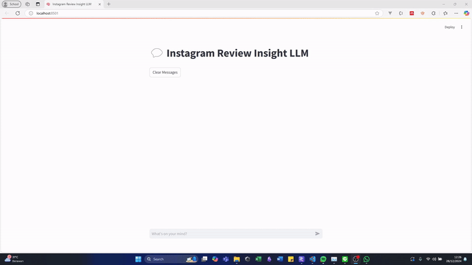
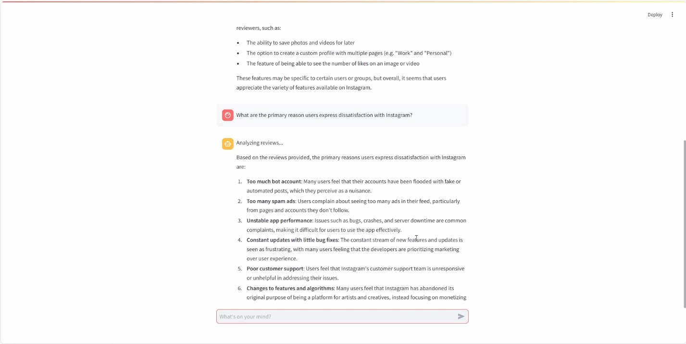

# RAG Instagram Reviews Insight

Python Version: 3.10.*

## Description
RAG Instagram Reviews Insight is a RAG Model that will answer questions about Instagram, based on the dataset of Instagram Google Play ratings and reviews. The model will analyze the reviews that might answer the user questions regarding current issues, improvements, opinion, and suggestions for Instagram.

GIF Preview             |  Image Sample Preview
:-------------------------:|:-------------------------:
  |  

## Installation Guide
1. Make sure you have Python 3.10 installed on your system. If not, download it from [here](https://www.python.org/downloads/).
2. Clone the repository using the following command:
```bash
git clone https://github.com/vncnttan/lacak-task1-rag-instagram-reviews.git
```
3. Install the required packages using the following command:
```bash
pip install -r requirements.txt
```
4. Download the embeddings file from [here](https://binusianorg-my.sharepoint.com/personal/vincent_tanjaya_binus_edu/_layouts/15/guestaccess.aspx?share=EtkbULEPc-VNh1GjSCmqFqkBmds5GEhgTK_xbhSNM72MCA&e=A9fNaa) and place it in the `embeddings/` directory on the root folder.
5. Install LM Studio [here](https://lmstudio.ai/) and download the llama_32_1b_instruct model. Start the server on 1234 port and make sure it is running by checking http://localhost:1234/v1/models on your browser.
6. Run the following command to start the application:
```bash
streamlit run main.py
```

## Under the Hood

Review CSV Data is processed using the following steps:
1. Load the dataset from the CSV file.
2. Preprocess the data by removing the missing values and duplicates.
3. Split the reviews by sentences, chunking, and remove unhelpful reviews (spammy reviews < 20 tokens) 
4. Encode the reviews using the pre-trained embeddings model all-mpnet-base-v2 using the Hugging Face Sentence Transformers library.
5. Save the processed embeddings to a csv file.

The RAG Model is implemented using the following steps:
1. Load the processed embeddings from the CSV file.
2. Load the embedding model.
3. Ask user prompts to input the questions.
4. Retrieve relevant reviews (20 reviews) by calculating the closest dot scores from the embedded query with the embedded prompt. This relevant reviews will be used as the context for the RAG model.
5. Generate the answer using the LLM model by providing the relevant reviews, prompt, and other context. The LLM model is locally deployed llama_32_1b_instruct using LM Studio.
6. Display the answer to the user.

## Future Improvements
The current implementation is still in the early stage and there are some issues on performance and speed because of time constraint. Here are some improvements that can be made in the future:
1. Implement Vector Stores like FAISS to store the embeddings and retrieve the closest dot scores for faster processing and query.
2. The current implementation uses context injection from the reviews and this takes a long time to process and uses so many tokens (every time the user query it will also send 20 relevant reviews regarding that question).

<video src="https://github.com/user-attachments/assets/9a44e7e9-c304-4922-80f0-449cc96ff0a4" autoplay loop />
